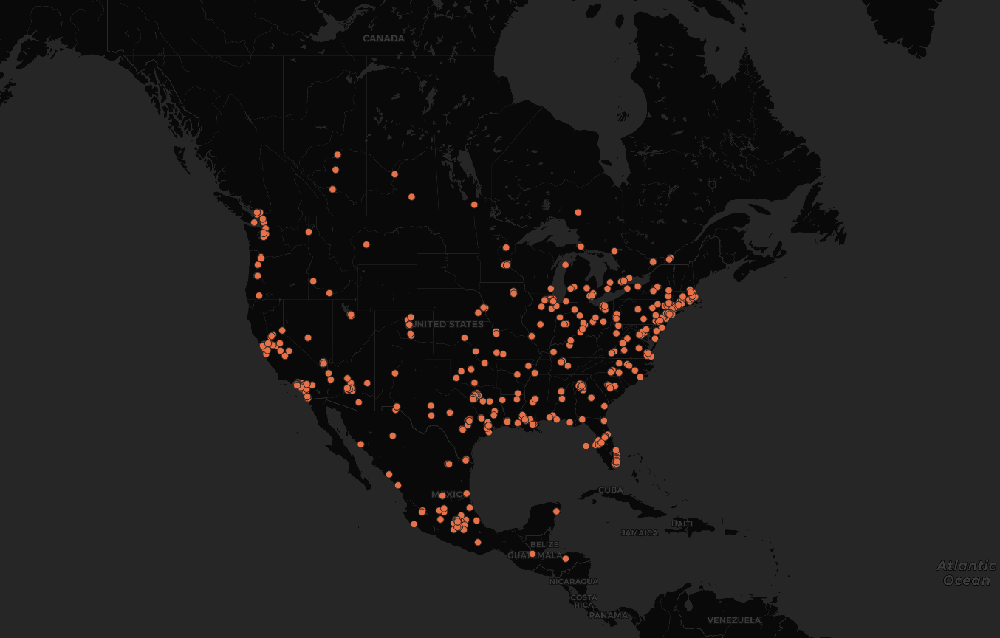

# Geo-tagged Tweet Collection and Visualization
For this lab I decided to take a look at tweets across North America. Surprisingly, there was a large concentration of tweets in Mexico, rather than Canada. This could be due to what tweets the scraper found first. A bulk of the tweets in Mexico also seem to be clustered around Mexico City, which is not surprising considering it is the Capitol and has the largest population in the country. Throughout the United States, we see a concentration of tweets on the East coast. There's also a concentration of tweets on the West Coast but it's not as large. This may be due to the time that these tweets were scraped, as it was scraped around 11AM PST, which is 2PM EST. More people may have been awake to tweet. There are also nearly no tweets found in the Midwestern region (North Dakota, South Dakota, Wyoming, etc.) This is probably due to the rural nature of these states, so they would statistically have less people tweeting.

*Note: tokens found in geosearch_crawler.ipynb are not valid.
Proof of developer account found [here](https://gyazo.com/b58f6647728ebfe69fbcdb257adfe469).*

